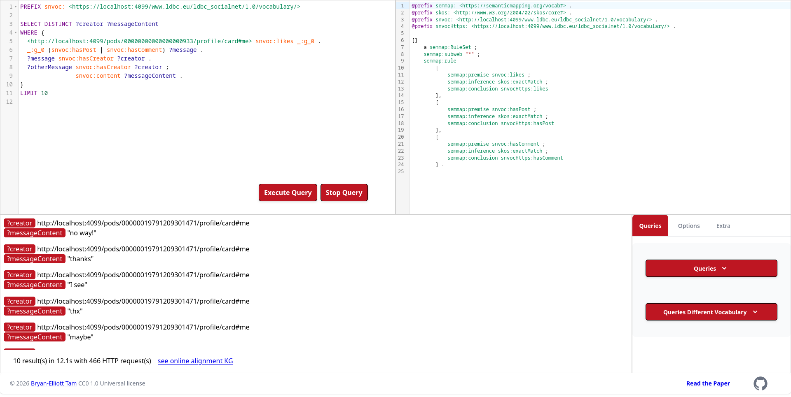

# Online Schema Alignment for Link Traversal Queries in Decentralized Knowledge Graphs

Demonstrator for the paper "Online Schema Alignment for Link Traversal Queries in Decentralized Knowledge Graphs."



A video is available online: https://www.youtube.com/watch?v=fGDQwu65los

## Prerequisites

- [Node.js 20](https://nodejs.org/en/download)
- [Yarn](https://yarnpkg.com/getting-started/install)
- [Docker](https://docs.docker.com/engine/install/)

## Getting Started

Clone the repository and run the initialization script:

```sh
./init.sh
```

Access the application at http://localhost:4050
